# Core_vision
OMR Auto Grading System using OpenCV that detects, analyzes, and grades MCQ answer sheets in real-time with high accuracy
# OMR MCQ Auto Grading System with OpenCV

---

##  Features

*  Real-time webcam scanning
*  Image-based processing
*  Automatic answer detection
*  Perspective correction
*  Pixel-based grading
*  Score visualization

---
##  Overview

An intelligent **OMR (Optical Mark Recognition) system** built with Python and OpenCV that automatically detects and grades MCQ answer sheets in real-time using computer vision techniques.

---

##  Demo
<h3>Input Sheets</h3>

<p align="center">
  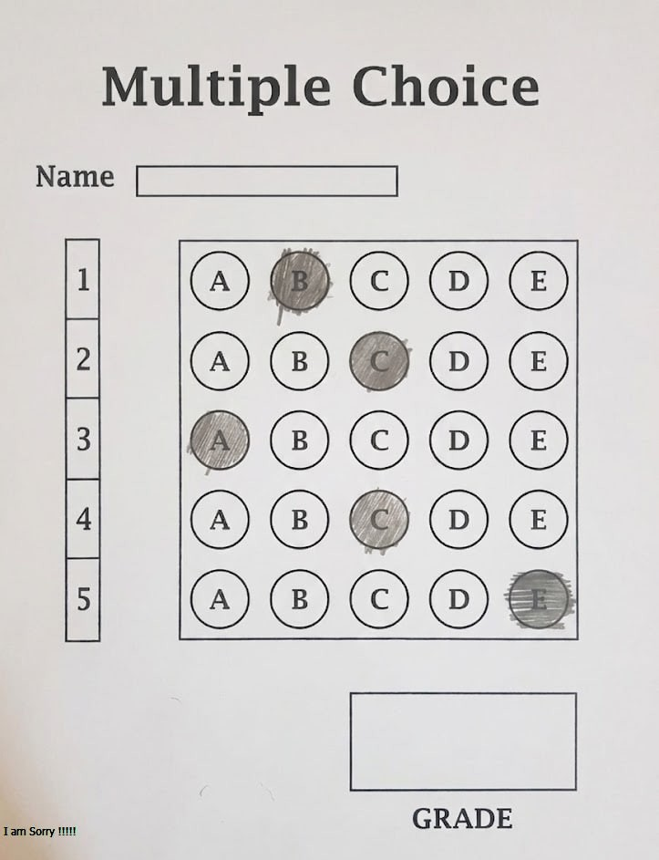
  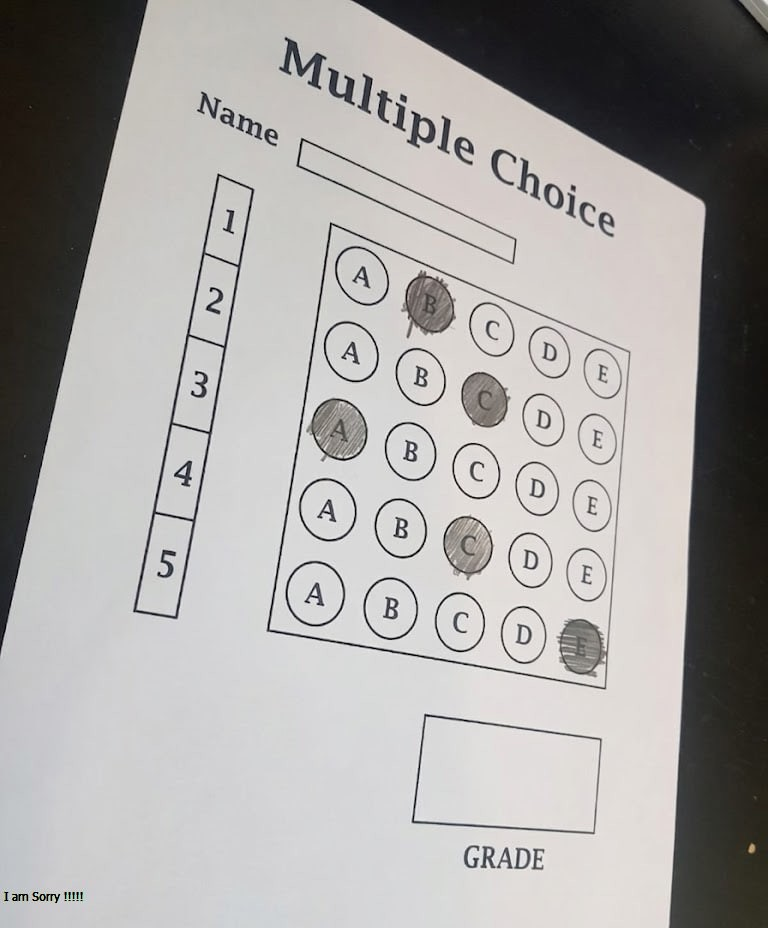
  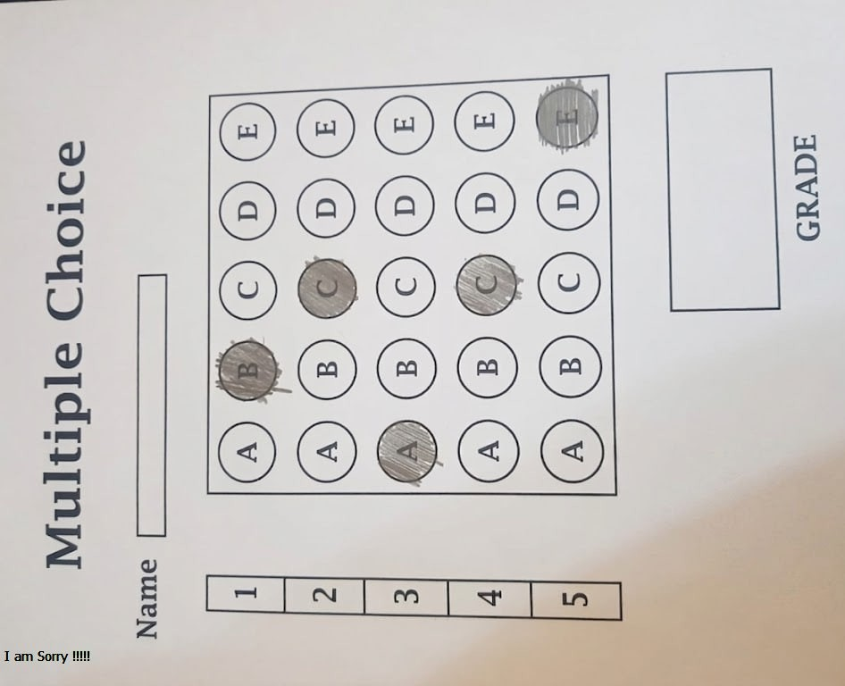
  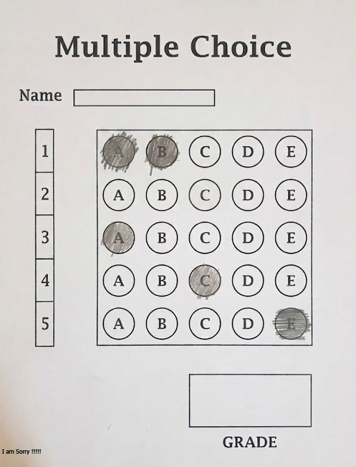
</p>
---

##  Image Processing Pipeline

### 1️⃣ Grayscale Conversion

Convert image to grayscale for easier processing.
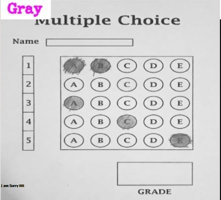
---

### 2️⃣ Edge Detection (Canny)

Detect object boundaries in the image.
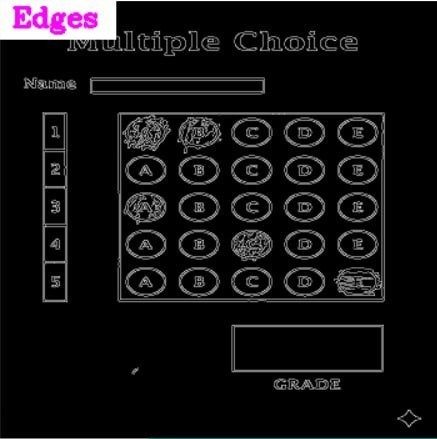
---
###  3️⃣Contour Detection

Identify the answer sheet using the largest contour.
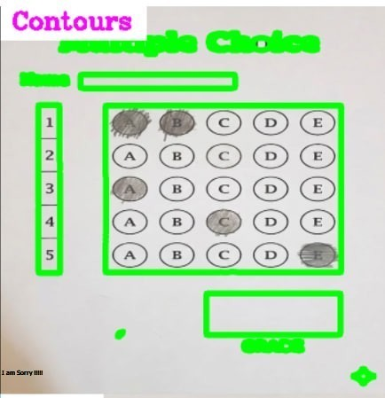
---

### 4️⃣threshold
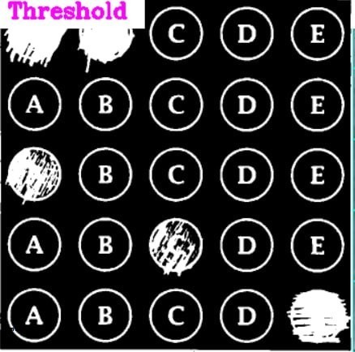
---

## 5️⃣ Perspective Transformation

The sheet is warped to a top-down view for accurate analysis.

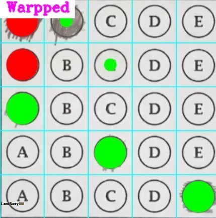
---

## 6️⃣ Final Result

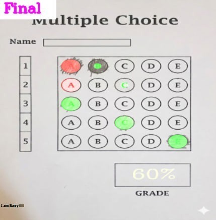
---

##  requirements Used

* Python
* OpenCV
* NumPy
---

##  Project Structure

```bash
OMR-Auto-Grading-System/
│── main.py
│── utlis.py
│── README.md
│
├── asset/
│   │── original.jpg
│   │── original2.jpg
│   │── original3.jpg
│   │── 2choices_no_answers.jpg
│   │── gray.jpg
│   │── edges.jpg
│   │── contours.jpg
│   │── warped.jpg
│   │── final.jpg
│   │── demo.gif
│
└── Scanned/
```

---

##  How to Run

```bash
pip install opencv-python numpy
python main.py
```

---

##  Controls

* Press **'s'** → Save result
* Press **ESC** → Exit

---

##  Team

* Ganna Amr Emad Eldin — **Team Leader**
* Habiba Saad Mohamed
* Haneen Mahmoud Abdel Fattah
* Rana Basyouni Askar
* Maryam Teama
* Hana Radwan
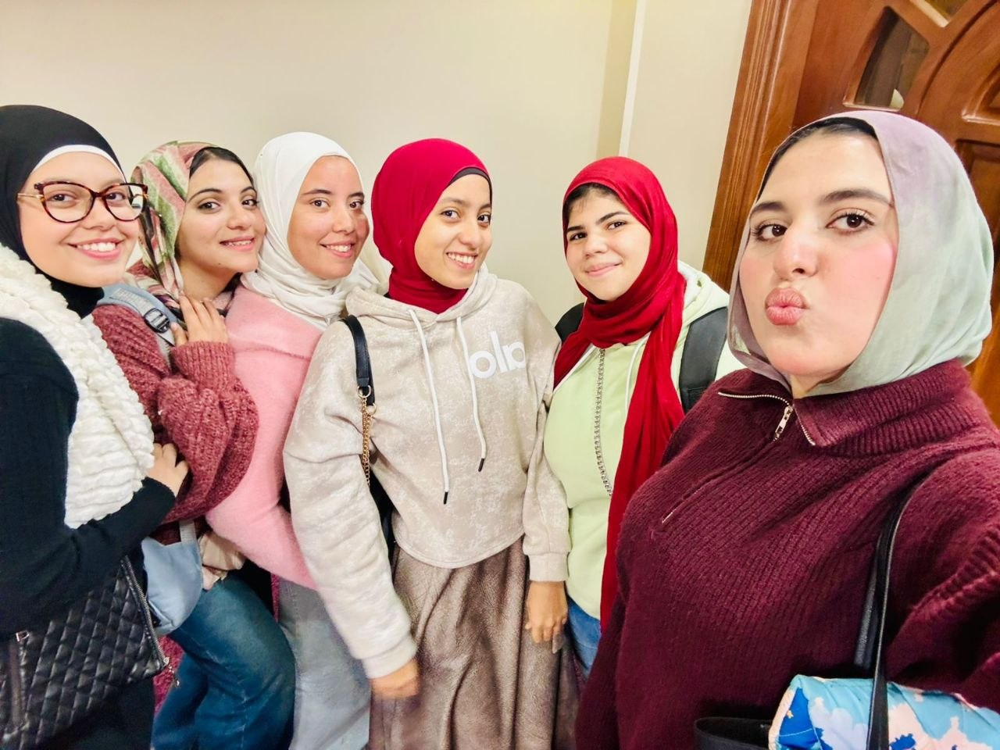
---

##  Acknowledgment

This project was developed as part of a Computer Vision and Image Processing course.

---

##  License

For educational purposes only.

---

 If you like this project, give it a star!

